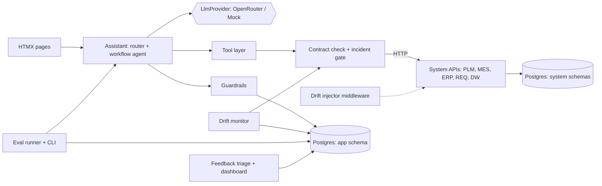

# LaunchLedger — PRD

Oct 2, 2026 · Donald Miller

## 1. Overview

LaunchLedger is an AI assistant over a fictional rocket manufacturer's enterprise systems, wrapped in the sustaining-engineering layer that keeps it trustworthy: regression evals in CI, upstream drift detection, machine-checkable guardrails and a feedback triage loop. Its core promise: **when upstream data changes silently, the assistant declines instead of answering confidently wrong, and the eval suite goes red.**

| Reference product | What we recreate | What we skip |
| --- | --- | --- |
| [promptfoo](https://github.com/promptfoo/promptfoo) | Golden-case eval suites, pass/fail thresholds, side-by-side model comparison | Web UI, red-teaming, provider zoo |
| [Langfuse](https://github.com/langfuse/langfuse) | Per-run traces of every LLM and tool step, user feedback linked to a trace, score trends | Hosted SaaS, `ee/` features, OpenTelemetry ingestion |
| [Great Expectations](https://github.com/great-expectations/great_expectations) | Declared schema and value expectations per source, validation results stored as incidents | Data docs site, checkpoint config DSL |
| [Guardrails AI](https://github.com/guardrails-ai/guardrails) | Validators run on every output; a failure blocks the answer with a named reason | The library itself and its hub; we write ~5 small rules |
| [Linear](https://linear.app) | Triage flow New → Triaged → Fixed → Verified, disposition labels | Everything else |

**The problem.** An enterprise AI assistant that reads live PLM, MES and ERP data fails in a specific, dangerous way: an upstream team renames a field or changes a unit, nothing errors, and the assistant keeps answering fluently with wrong numbers. Teams sustaining these assistants usually verify by hand, find out from users, and cannot say whether a model or prompt upgrade made things better or worse. LaunchLedger demonstrates the engineering that closes those gaps, end to end, on realistic fake data.

It is also a portfolio piece aimed at an enterprise AI sustaining-engineering role, so every feature maps to a concrete responsibility: regression coverage for production workflows, schema-drift remediation, guardrails, feedback triage and leadership reporting.

## 2. Goals and non-goals

v1 must prove five things on a laptop with one `docker compose up`.

1. **Grounded answers.** The assistant answers manufacturing and supply-chain questions over three fake enterprise systems (PLM, MES, ERP), reached only through their REST APIs, with every claim cited to a source record.
2. **Regression coverage.** Every workflow has golden eval cases, graded deterministically, run in CI on every push; a pass rate below threshold fails the build.
3. **Drift safety.** Three injectable upstream drift scenarios each cause the assistant to decline affected questions (never answer them wrongly) and open a drift incident naming the system and field.
4. **Guardrails.** Machine-checkable rules run on every answer; a failure blocks the answer and names the rule.
5. **Traceability.** Every run stores a trace of its LLM calls, tool calls, contract checks and guardrail results, viewable in the UI.

P1 adds the feedback triage queue, the leadership dashboard, two more systems (requirements, data warehouse) and six more workflows.

**Non-goals**

- Real authentication, SSO, roles or multi-tenancy: one hardcoded user.
- Real enterprise integrations; all five systems are fake, seeded deterministically.
- RAG over documents, embeddings or a vector store: the assistant reads structured records through tools only.
- Multi-turn conversational memory: each question is an independent run.
- Fine-tuning or training models.
- LLM-as-judge grading in v1 (P2 at most); grading is deterministic.
- Deployment beyond Docker Compose; no cloud, Kubernetes or managed services.
- A rich SPA frontend; server-rendered HTMX pages only.
- Real export-control compliance; the export-control guardrail is a demonstration rule over a fake flag.

## 3. Users and user stories

Three roles share one hardcoded account: a **floor user** (manufacturing, quality or supply-chain engineer) who asks questions, the **AI platform engineer** who sustains the assistant, and a **leader** who reads its health. The fictional company is Halcyon Aerospace; all data is synthetic.

| # | As a user, I want to… | So that… |
| --- | --- | --- |
| U1 | ask "Where is SN-0042 and what's blocking it?" in plain English | I get the status without opening three systems |
| U2 | see every claim in an answer cited to the record it came from, and open that record | I can verify before I act |
| U3 | be told plainly when the assistant cannot verify an answer, and why | I never act on a confident wrong answer |
| U4 | (platform) run the full eval suite with one command and in CI | a prompt, model or dependency change cannot silently regress a workflow |
| U5 | (platform) inject a realistic upstream drift scenario and watch the system catch it | I can prove drift handling works before a real upstream change does |
| U6 | (platform) see open drift incidents with the system, field and first-seen time | I know exactly which upstream change to chase |
| U7 | (platform) open any run's trace: tool calls, contract checks, guardrail results | I can diagnose a bad answer in minutes |
| U8 | rate an answer thumbs-down with a reason | the platform team hears about problems |
| U9 | (platform) triage feedback through New → Triaged → Fixed → Verified and turn a bad run into a new eval case | every reported bug becomes a permanent regression test |
| U10 | (leader) see backlog inflow vs. outflow, eval pass rate per workflow and drift incidents over time | I know whether the assistant is getting more or less trustworthy |
| U11 | (platform) compare two models on the same eval suite | a model upgrade is a measured decision, not a guess |

## 4. Functional requirements

P0 = v1 must have, P1 = v1 should have, P2 = later. Every E2E scenario and eval case traces back to these IDs.

### Enterprise systems (S)

| ID | Requirement | Priority |
| --- | --- | --- |
| S1 | **PLM** system: parts (`part_number`, `name`, `revision`, `mass_kg`, `unit_cost_usd`, `export_controlled`, `controlled_notes`) and BOM lines (`bom_line_id`, `parent_pn`, `child_pn`, `qty`). | P0 |
| S2 | **MES** system: serials (`serial_number`, `part_number`, `revision`, `status`, `location`), work orders (`wo_id`, `serial_number`, `status` ∈ OPEN/IN_PROGRESS/BLOCKED/CLOSED, `blocked_reason`, `depends_on_po`, `description`), inspections, nonconformances (`ncr_id`, `serial_number`, `severity`, `status`, `requirement_id`, `description`). | P0 |
| S3 | **ERP** system: suppliers, purchase orders (`po_id`, `supplier_id`, `part_number`, `qty`, `due_date`, `promised_date`, `status`, `unit_cost_usd`). | P0 |
| S4 | Each system is its own FastAPI sub-app under `/systems/<name>/…` with its own Postgres schema and read-only JSON endpoints (get by ID, list with filters, pagination). | P0 |
| S5 | A deterministic seed (`ll seed`, fixed RNG seed 42) creates ~120 parts, ~300 serials, ~400 work orders, 25 suppliers, ~600 POs, ~80 NCRs, including named demo records (SN-0042, P-1077, supplier "Apex Castings") that the golden cases reference. | P0 |
| S6 | Record viewer: `/records/<system>/<type>/<id>` renders any source record; every citation links here. | P0 |
| S7 | **Requirements** system: requirements (`req_id`, `text`, `verification_method`) linked to parts. | P1 |
| S8 | **Data warehouse** system: read-only rollups (supplier on-time rate, work-order cycle time by part), rebuilt by `ll dw rebuild`. | P1 |

### Assistant (A)

| ID | Requirement | Priority |
| --- | --- | --- |
| A1 | One question = one run. A router step picks a workflow (shown as a chip); the user can override it with a workflow dropdown. | P0 |
| A2 | Each workflow is a tool-calling agent with its own system prompt, allowed-tool list and a max of 8 tool calls. | P0 |
| A3 | The assistant reaches data **only** through tools that call the system REST APIs over HTTP. It never queries Postgres directly. | P0 |
| A4 | Final output is structured: `answer` (prose), `claims[]` each with `facts[]` (`system`, `record_type`, `record_id`, `field`, `value`) and `caveats[]`. The UI renders claims with citation links. | P0 |
| A5 | Every run ends with exactly one decision: **Answered**, **Declined** (data could not be verified) or **Blocked** (a guardrail failed), shown as a badge with the reason. | P0 |
| A6 | LLM access goes through one `LlmProvider` interface with two implementations: `OpenRouterProvider` and `MockProvider` (scripted, `LLM_MODE=mock`). | P0 |
| A7 | Model slugs come from env (`ROUTER_MODEL`, `WORKFLOW_MODEL`, `COMPARE_MODEL`); `config/models.toml` pins temperature 0, max tokens and timeouts; every run records the exact slug used. | P0 |

### Workflows (W)

| ID | Workflow and example question | Priority |
| --- | --- | --- |
| W1 | `serial_status`: "Where is SN-0042 and what's blocking it?" | P0 |
| W2 | `supplier_impact`: "Which open work orders are at risk from late POs from Apex Castings?" | P0 |
| W3 | `where_used`: "Which assemblies use part P-1077?" | P0 |
| W4 | `ncr_summary`: "What open nonconformances are there against SN-0042?" | P0 |
| W5 | `po_status`: "What's the status of PO-10233 and is it late?" | P0 |
| W6 | `build_readiness`: "Is SN-0042 ready for stage integration?" (all WOs closed, inspections passed, no open NCRs) | P0 |
| W7 | `requirement_trace`: requirement → parts → open NCRs | P1 |
| W8 | `revision_impact`: serials and open WOs affected if a part moves to a new revision | P1 |
| W9 | `supplier_scorecard`: on-time rate and open late POs per supplier (DW) | P1 |
| W10 | `cycle_time`: work-order cycle time for a part vs. its trailing average (DW) | P1 |
| W11 | `shortage_report`: parts whose open POs cover less than open WO demand | P1 |
| W12 | `export_check`: which parts in an assembly are export-controlled | P1 |

### Guardrails (G)

| ID | Requirement | Priority |
| --- | --- | --- |
| G1 | `citation_required`: every claim has at least one fact. | P0 |
| G2 | `facts_match_source`: every fact's `value` equals the live record's field value (re-fetched through the system API). | P0 |
| G3 | `ids_exist`: every ID-shaped token in the answer prose (`SN-\d{4}`, `P-\d{4}`, `PO-\d{5}`, `WO-\d{5}`, `NCR-\d{4}`) exists in its system, unless the same ID appears in a caveat (an ID the answer itself says it could not find). | P0 |
| G4 | `export_control`: no fact cites a field of an `export_controlled` part other than `part_number`, `name` and `export_controlled`, and the answer prose contains neither a controlled part's `controlled_notes` text nor any number from it. | P0 |
| G5 | `uncertainty_stated`: if any tool call failed or returned empty / not found, the answer has at least one caveat. | P0 |
| G6 | Guardrails are pure functions in a registry, each with unit tests; results are stored per run and shown in the trace. | P0 |

### Evals (V)

| ID | Requirement | Priority |
| --- | --- | --- |
| V1 | Golden cases live in `evals/cases/<workflow>.yaml`: question, expected workflow, `expected_facts[]`, `forbidden_values[]`, expected decision. 5 cases per P0 workflow (30 total). | P0 |
| V2 | Deterministic grader: a case passes when the routed workflow and the decision match, every expected fact appears in the claims and no forbidden value appears. No LLM judge. | P0 |
| V3 | `ll eval run [--model mock\|<slug>] [--workflow W1…] [--drift <scenario>]` writes a JSON report and stores the run in the DB. | P0 |
| V4 | Thresholds in `config/evals.toml` (mock: 100%, real model: 90% per workflow). The command exits non-zero below threshold. | P0 |
| V5 | GitHub Actions runs lint, unit, integration, the mock eval suite and every drift-mode eval on each push and PR. | P0 |
| V6 | `/evals` lists runs; a run page shows per-workflow pass rate and each case's diff (expected vs. got). | P0 |
| V7 | 5 golden cases for each P1 workflow (60 total). | P1 |
| V8 | `ll eval compare <slugA> <slugB>`: the same suite on two models, side-by-side pass rate, latency and token cost report. | P2 |

### Drift (D)

| ID | Requirement | Priority |
| --- | --- | --- |
| D1 | Each system has a **contract**: a pydantic schema of every endpoint's response plus declared value expectations (ranges, enums, nullability). | P0 |
| D2 | Inline check: every tool response is validated against its contract **before** the model sees it. A violation stops the run with decision **Declined**, naming the system, endpoint and field, and opens or updates a drift incident. | P0 |
| D3 | Batch monitor: every `DRIFT_MONITOR_INTERVAL_S` (default 300) and on `ll drift check`, sample each list endpoint and compare value distributions (p50, min, max per numeric field) to the stored baseline. A shift beyond the declared tolerance opens an incident. | P0 |
| D4 | While an incident is open for a system and field, any tool response containing that field is treated as a violation (D2). Resolving the incident lifts the gate. | P0 |
| D5 | Drift injector (demo and test only, `DRIFT_INJECTION=1`): response-transform middleware on the system APIs, toggled by `ll drift enable\|disable <scenario>` and `/drift`. P0 scenarios: `erp_rename_promised_date` (field becomes `promise_date`), `mes_new_wo_status` (adds `HOLD_QA`), `erp_cost_in_cents` (`unit_cost_usd` × 100, same field name). | P0 |
| D6 | `/drift` page: per-system status (green/red), active injected scenarios, incident list (system, field, kind, first seen, runs affected), resolve button. | P0 |
| D7 | P1 scenarios: `plm_null_revision` (20% of `revision` null), `erp_date_format` (dates as MM/DD/YYYY). | P1 |

### Traces (T)

| ID | Requirement | Priority |
| --- | --- | --- |
| T1 | Each run stores its question, workflow, model, every LLM call (messages, tool calls, tokens, latency), every tool call (system, endpoint, status, latency, contract result), guardrail results and decision. | P0 |
| T2 | `/runs` lists runs, filterable by decision and workflow; `/runs/<id>` shows the full trace as a timeline. | P0 |

### Feedback (F)

| ID | Requirement | Priority |
| --- | --- | --- |
| F1 | Thumbs up/down on every answer; thumbs-down requires a reason (wrong data, missing data, unclear, slow, other) plus optional text. | P1 |
| F2 | `/feedback` triage queue: status New → Triaged → Fixed → Verified (or Won't fix), disposition (data issue, prompt issue, guardrail false positive, drift, feature request), each change logged with a timestamp. | P1 |
| F3 | "Convert to eval case" on a feedback item writes a draft golden case YAML from the run's question and the corrected expected facts. | P1 |

### Dashboard (B)

| ID | Requirement | Priority |
| --- | --- | --- |
| B1 | `/dashboard`: weekly feedback inflow vs. outflow, open backlog by status, eval pass rate per workflow across runs, drift incidents over time, decision mix (answered / declined / blocked). | P1 |
| B2 | `ll report weekly` writes the same numbers as a Markdown report for leadership. | P2 |

## 5. Non-functional requirements

The whole suite must run offline and deterministically in mock mode; only `@smoke` tests touch a real model.

| Area | Requirement |
| --- | --- |
| Latency | Mock mode (with `MOCK_LATENCY_MS=0`): p95 run < 1 s. Real model: p95 run < 20 s. System API p95 < 100 ms on seeded data. |
| Limits | Max 8 tool calls per run; tool responses truncated to 50 records with a `truncated: true` flag the model is told about; LLM call timeout 60 s, one retry on 5xx/429. |
| Reliability | A failed tool or LLM call never crashes the run; it ends Declined with the error in the trace. A crashed monitor tick logs and continues. |
| Determinism | Seed fixed (42). "Today" comes from an injected clock; `FROZEN_TODAY=2026-10-01` in tests and demo so "late" is stable. Mock LLM keyed by trigger phrases, never random. |
| Security | Secrets only in `.env` (`OPENROUTER_API_KEY`); never logged or stored in traces. Drift injector and admin routes return 404 unless `DRIFT_INJECTION=1`. Test routes return 404 unless `TEST_MODE=1`. |
| Configuration | All config via env vars read once into a pydantic-settings object at startup; startup fails fast with a named message on a missing or invalid var. Models' parameters and eval thresholds in TOML under `config/`. |
| Deployment | `docker compose up` brings up `app` + `postgres`; migrations and seed run on first start. Python 3.12, `uv`-locked dependencies. |
| Testability | Unit (pytest), integration (pytest against a real Postgres from compose), E2E (pytest-playwright), evals (mock suite), plus a Playwright MCP walkthrough via the `playwright-headless` server. Every interactive element carries the `data-testid` from E2E_TESTS.md. |
| Accessibility | Semantic HTML, labelled form controls, decision badges carry text not just colour, keyboard-reachable actions. |
| Cost | CI never calls a paid API. The real-model eval prints token usage and estimated cost per run. |

### Licensing

No code is copied from any reference product; only functionality is recreated.

| Project | Licence | Implication |
| --- | --- | --- |
| promptfoo | MIT | Functionality only; no code copied. |
| Langfuse | MIT core; `ee/` under a commercial licence | Recreate tracing ideas only; never look at or copy `ee/`. |
| Great Expectations | Apache 2.0 | Functionality only; no dependency. |
| Guardrails AI | Apache 2.0 | Functionality only; no dependency. |
| Linear | Proprietary | Workflow concept only. |
| HTMX, FastAPI, SQLAlchemy, Alembic, pydantic, httpx, Typer, Jinja2 | BSD / MIT | Used as dependencies; fine. |
| htmx (vendored file) | 0BSD | Fine. |

## 6. Technical architecture

One FastAPI process serves the UI, the assistant and the fake systems; the assistant reaches the systems only over HTTP through a contract-checking tool layer, so drift behaves exactly as it would against real external services.

### Stack

| Layer | Choice | Why |
| --- | --- | --- |
| Language / deps | Python 3.12, `uv` | Matches the target role; locked, fast installs |
| Web | FastAPI + Jinja2 + HTMX (vendored) + one hand-written CSS file | One language, no JS build step, no CDN at test time |
| Data | Postgres 16, SQLAlchemy 2, Alembic | SQL skills on show; migrations from day one |
| Validation | pydantic v2, pydantic-settings | Contracts, structured outputs and config in one tool |
| HTTP | httpx (async) | Tool calls to system APIs; OpenRouter calls (OpenAI-compatible, no SDK) |
| LLM | OpenRouter chat completions with tool calling | One key, any model; enables cross-vendor comparison |
| CLI | Typer, entry point `ll` | Seed, eval, drift, report commands |
| Scheduling | asyncio task started in the FastAPI lifespan | Drift monitor; no extra dependency |
| Tests | pytest + pytest-playwright (Chromium), `playwright-headless` MCP | Unit through E2E plus a scripted walkthrough |
| CI | GitHub Actions with a Postgres service container | Gate on every push |
| Runtime | Docker Compose: `app` + `postgres` | One-command start |

### Data model

System schemas (`plm`, `mes`, `erp`, `req`, `dw`) hold the fake source data; the `app` schema holds everything LaunchLedger itself produces.

| Table | Key columns | Notes |
| --- | --- | --- |
| `plm.parts` | `part_number` PK, `revision`, `mass_kg`, `unit_cost_usd`, `export_controlled`, `controlled_notes` | |
| `plm.bom_lines` | `bom_line_id` PK, `parent_pn`, `child_pn`, `qty` | |
| `mes.serials` | `serial_number` PK, `part_number`, `revision`, `status`, `location` | |
| `mes.work_orders` | `wo_id` PK, `serial_number`, `status`, `blocked_reason`, `depends_on_po`, `description` | |
| `mes.inspections` | `inspection_id` PK, `serial_number`, `result`, `inspected_at` | |
| `mes.nonconformances` | `ncr_id` PK, `serial_number`, `severity`, `status`, `requirement_id`, `description` | |
| `erp.suppliers` / `erp.purchase_orders` | `supplier_id`, `name`; `po_id` PK, `due_date`, `promised_date`, `status`, `unit_cost_usd` | |
| `req.requirements` / `req.part_links` | `req_id`, `verification_method`; `req_id`, `part_number` | P1 |
| `dw.supplier_on_time`, `dw.wo_cycle_time` | rollup keys + metrics | P1, rebuilt by `ll dw rebuild` |
| `app.runs` | `id`, `question`, `workflow`, `workflow_source`, `model`, `decision`, `decision_reason`, `answer_json`, `created_at` | |
| `app.run_steps` | `run_id`, `seq`, `kind` (llm/tool/contract/guardrail), `payload_json`, `latency_ms`, `tokens` | The trace |
| `app.guardrail_results` | `run_id`, `rule`, `passed`, `detail` | |
| `app.contract_baselines` | `system`, `endpoint`, `field`, `p50`, `min`, `max`, `captured_at` | Captured by `ll drift baseline` |
| `app.drift_incidents` | `id`, `system`, `endpoint`, `field`, `kind` (shape/enum/distribution), `status`, `first_seen`, `runs_affected` | |
| `app.drift_scenarios` | `name`, `enabled` | Injector state |
| `app.eval_runs` / `app.eval_results` | `id`, `model`, `drift_scenario`, `pass_rate`; `case_id`, `passed`, `diff_json` | |
| `app.feedback` / `app.feedback_events` | `id`, `run_id`, `rating`, `reason`, `status`, `disposition`; `feedback_id`, `from_status`, `to_status`, `at` | P1 |

### Key interfaces

| Name | Input | Effect |
| --- | --- | --- |
| `POST /api/ask` | `{question, workflow?}` | Runs router + workflow, returns run id; the page polls/swaps the answer card via HTMX |
| `GET /runs/{id}` | — | Trace timeline |
| `POST /api/feedback` | `{run_id, rating, reason?, text?}` | Creates a feedback item (P1) |
| `POST /api/admin/drift/{scenario}/{enable\|disable}` | — | Toggles injection (only with `DRIFT_INJECTION=1`) |
| `POST /api/admin/drift/incidents/{id}/resolve` | — | Lifts the D4 gate |
| `GET /healthz` | — | `{"status":"ok","db":true,"llm_mode":"mock"}` |
| Tools (agent) | `get_serial`, `list_work_orders`, `list_inspections`, `get_part`, `get_bom`, `where_used`, `list_ncrs`, `get_po`, `list_pos`, `get_supplier`, `find_supplier` (+ P1: `get_requirement`, `list_requirements_for_part`, `dw_supplier_on_time`, `dw_cycle_time`) | Each = one HTTP call to a system API, contract-checked before the result reaches the model |
| CLI `ll` | `seed`, `eval run`, `eval compare`, `drift baseline\|check\|enable\|disable`, `dw rebuild`, `report weekly`, `demo seed-activity` | |

### Rules that are easy to get wrong

- **The model never sees an unchecked tool response.** Contract validation (D2) and the incident gate (D4) run between the HTTP call and the message appended to the model's context.
- **Declined beats answered.** If any contract violation, tool error or open gated incident touched the run, the decision cannot be Answered, regardless of what the model wrote.
- **Guardrails re-read the source.** G2 re-fetches each cited record through the system API rather than trusting the trace, so a fact the model invented can never pass.
- **The mock is real enough.** `MockProvider` returns scripted tool calls, but those tool calls hit the real seeded system APIs through the real contract layer; only the LLM is faked. That is what makes drift E2E tests meaningful.
- **Golden values come from the seed.** Never hand-type expected values that could drift from the seed; a test asserts every golden fact matches the seeded DB.

## 7. Milestones

Ten stages (0–9); stages 0–5 are the P0 product and stage 5 proves the core promise. Each stage ends with its E2E specs green and a `playwright-headless` walkthrough logged in `docs/VERIFICATION.md`.

| Stage | Scope | Done when |
| --- | --- | --- |
| 0 | Skeleton: `uv` project, Docker Compose (app + Postgres), Alembic, settings with fail-fast validation, `/healthz`, base layout with nav, `MockProvider` loading `fixtures/llm-mock.json`, pytest + Playwright harness, GitHub Actions, **every E2E spec written** (failing is fine) | `docker compose up` → `/healthz` returns `{"status":"ok","db":true,"llm_mode":"mock"}`; CI runs and reports the expected failures |
| 1 | Systems: S1–S6, deterministic seed, record viewer | `GET /systems/mes/serials/SN-0042` returns the seeded record; `/records/mes/serial/SN-0042` renders it; seeding twice yields identical row hashes |
| 2 | Assistant core: A1–A7, tool layer (no contracts yet), W1–W3, T1–T2, Ask page | In mock mode, asking "Where is SN-0042 and what's blocking it?" shows an **Answered** badge, the `serial_status` chip and citations that open the MES records; `/runs/<id>` lists every tool call |
| 3 | W4–W6, guardrails G1–G6 | A mock script that cites a non-existent `SN-9999` ends **Blocked** with "ids_exist" named; a script that cites a wrong `status` value ends **Blocked** by `facts_match_source` |
| 4 | Evals V1–V6, 30 golden cases, CI gate | `ll eval run --model mock` reports 30/30 and exits 0; changing one golden value makes it exit 1 and the CI job fail; `/evals/<id>` shows the failing case's diff |
| 5 | Drift D1–D6: contracts, baselines, inline check, monitor, incident gate, injector (3 scenarios), `/drift`, drift-mode evals | **Core scenario:** with `erp_rename_promised_date` enabled, the Apex Castings question ends **Declined** naming ERP and `promised_date`, an incident appears on `/drift`, and `ll eval run --drift erp_rename_promised_date` reports 0 wrong answers; disable + resolve → the same question is Answered again |
| 6 | Feedback F1–F3 | Thumbs-down with reason "wrong data" appears in `/feedback` as New; moving it to Triaged → Fixed → Verified logs three events; "Convert to eval case" writes a YAML file that `ll eval run` picks up |
| 7 | S7–S8, W7–W12, V7, D7 | `ll eval run --model mock` reports 60/60; both P1 drift scenarios end Declined in drift-mode evals |
| 8 | Dashboard B1 | `/dashboard` shows all five panels populated from seeded demo activity (`ll demo seed-activity`), and the numbers match SQL counts in an integration test |
| 9 | P2 extras: V8 model compare, B2 weekly report, `docs/RUNBOOK.md`, `docs/DEMO.md` (2-minute demo script) | `ll eval compare` produces a side-by-side Markdown report for two OpenRouter models; final acceptance: all suites green in dev and in Docker |

## 8. Success metrics, risks and open questions

v1 succeeds when the drift demo runs end to end with zero confidently-wrong answers and every suite is green in CI.

### Metrics

| Metric | Target |
| --- | --- |
| Mock eval pass rate (P0 cases) | 30/30 (100%) |
| Real-model eval pass rate, default workflow model | ≥ 90% per workflow |
| Wrong answers under each drift scenario (drift-mode evals) | 0 |
| Guardrail false positives on the golden set | 0 |
| Mock run latency p95 | < 1 s |
| CI wall time | < 10 min |
| Time from injecting drift to an open incident (batch kind) | ≤ 1 monitor interval (300 s), or immediate on `ll drift check` |

### Risks

| Risk | Likelihood | Mitigation |
| --- | --- | --- |
| Real models vary in tool-calling quality on OpenRouter, so real-model evals flake | High | Temperature 0, pin slugs, grade structured facts not prose, 90% threshold, real model only in `@smoke` and manual runs |
| Structured `claims/facts` output is hard for some models to produce reliably | Medium | Validate with pydantic; one repair retry with the validation error; failure ends Declined, never a crash |
| Distribution monitor raises false incidents on small samples | Medium | Sample ≥ 200 rows; tolerance declared per field; unit tests on the seeded baseline prove no incident without injection |
| Golden values drift from the seed as the seed evolves | Medium | Test that asserts each golden fact against the seeded DB |
| Scope creep into a full observability platform | Medium | Non-goals list; P1/P2 stages only after stage 5 is green |
| HTMX async answer rendering makes E2E timing flaky | Low | Fixed `data-testid` on the final answer card with a `data-run-id`; wait on it, never on timers |

### Open questions

- [x] Fresh build or extend an existing project? **Fresh build**, new folder `LaunchLedger`.
- [x] UI technology? **FastAPI + Jinja2 + HTMX**, no JS build.
- [x] LLM provider? **OpenRouter**, with a scripted mock for tests.
- [x] E2E runner? **pytest-playwright**, so the whole repo stays Python.
- [x] Output format (A4)? **Structured claims with field-level facts**, one repair retry on invalid output.
- [x] Routing? **Auto-route with manual override**; router accuracy is graded in every eval case.
- [ ] Default OpenRouter model slugs: workflow model, router model and a comparison model for V8. Left blank in `.env.example` for you to fill.
- [ ] Fictional company name "Halcyon Aerospace" acceptable? Assumed yes.

### References

- [promptfoo](https://github.com/promptfoo/promptfoo)
- [Langfuse](https://github.com/langfuse/langfuse)
- [Great Expectations](https://github.com/great-expectations/great_expectations)
- [Guardrails AI](https://github.com/guardrails-ai/guardrails)
- [HTMX](https://htmx.org)
- [OpenRouter tool calling](https://openrouter.ai/docs/features/tool-calling)
